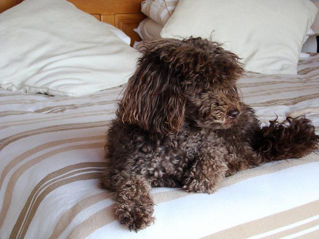
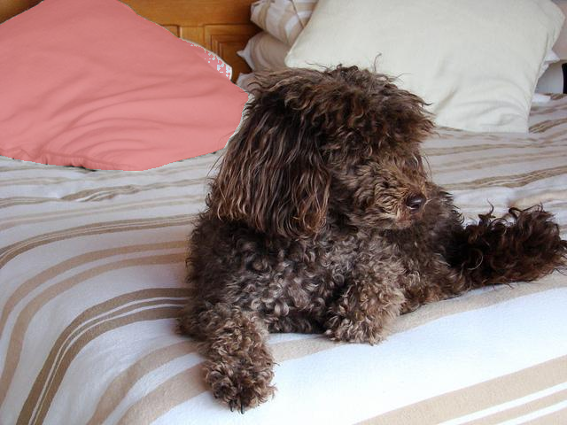
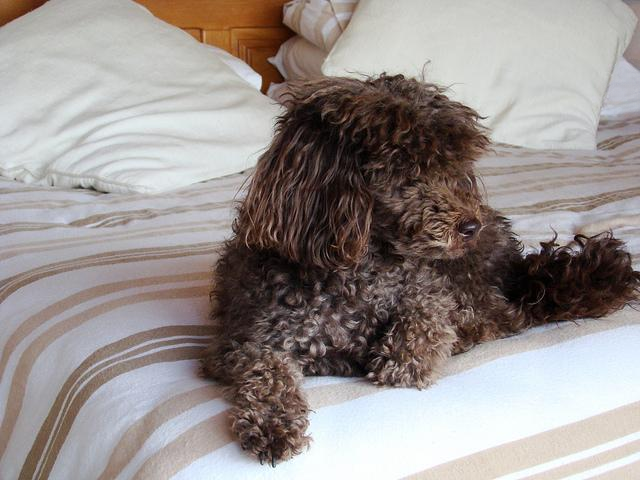
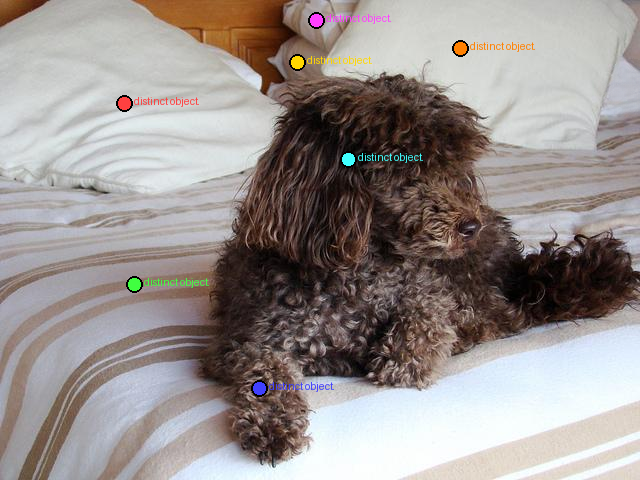
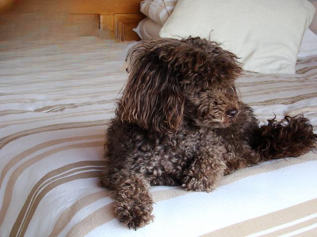
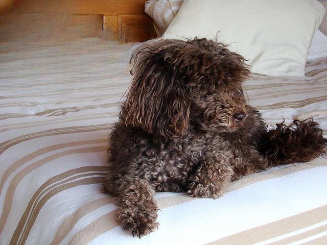
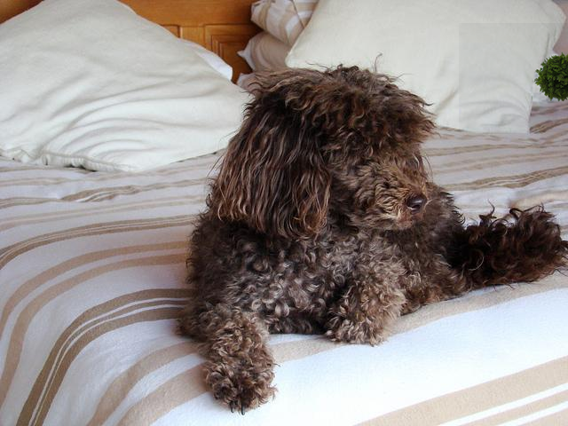

# Visual Jenga Reproduction

**Author:** [Jie Wang](https://everloom-129.github.io/)

## Introduction

Visual Jenga is a method for discovering **object dependency order** in a scene. Given an image, the pipeline iteratively identifies and removes the "most removable" object — the one whose absence is hardest to distinguish from a real background — until the scene is empty. The resulting sequence reveals which objects are structural anchors and which are freely removable.

This page documents a full reproduction of the method described in the Visual Jenga paper, implemented end-to-end with open-source models.

### Diversity Score

The core scoring signal is the **diversity score** (Equation 2 from the paper):

$$
\text{diversity} = 1 - \frac{\overline{\text{CLIP\_sim}} \times \overline{\text{DINO\_sim}}}{\text{area\_fraction}}
$$

Where:
- $\overline{\text{CLIP\_sim}}$ — mean CLIP cosine similarity between the original crop and each inpainted sample
- $\overline{\text{DINO\_sim}}$ — mean DINOv2 cosine similarity between the original crop and each inpainted sample
- $\text{area\_fraction}$ — fraction of the bounding box covered by the object mask (normalises for object size)

A **high diversity score** means the inpainted slot looks very different across samples — the region can be filled by many things — so the object is not structurally required and should be removed first. A **low score** means only one plausible completion exists, indicating a load-bearing object that should be removed last.

:::note
The area fraction denominator upweights small objects. Without it, tiny objects would score artificially low just because their inpainted crops vary less in absolute pixel terms.
:::

---

## Pipeline Architecture

The pipeline has two alternating phases per step to fit inside a single 24 GB A10 GPU.

### Model Table

| Module | Class | Model | Role |
|--------|-------|-------|------|
| `detect.py` | `MolmoDetector` | `allenai/Molmo-7B-D-0924` | Points at every distinct object; returns `(label, x_frac, y_frac)` |
| `segment.py` | `SAM2Segmenter` | `facebook/sam2-hiera-large` | Segments one object per point; returns binary mask |
| `inpaint.py` | `SDInpainter` | `runwayml/stable-diffusion-inpainting` | Generates N diverse inpaintings for diversity scoring |
| `similarity.py` | `SimilarityModel` | CLIP ViT-L/14 + `facebook/dinov2-base` | Pairwise cosine similarity for scoring |
| `diversity.py` | `diversity_score()` | — (pure NumPy) | Computes Eq. 2 using `SimilarityModel` |
| `inpaint.py` | `LaMaRemover` | `big-lama` | Clean background reconstruction for the final output frame |

### Phase A — Detect and Segment

1. **Detect (Molmo):** The 7B multimodal model receives the current image with the prompt `"Point to every distinct object."` and returns XML-like `<point x="..." y="...">label</point>` tags. Coordinates are normalised to [0, 1].
2. **Segment (SAM2):** Each detection point is passed to SAM2, which produces a binary foreground mask. Duplicate masks (IoU > 0.85) are deduplicated, keeping the larger one.

Molmo is unloaded and `torch.cuda.empty_cache()` is called before SAM2 loads, and again before Phase B begins.

### Phase B — Score and Remove

3. **Score (SD + CLIP + DINOv2):** For each object, SD 1.5 inpaints N=16 diverse samples into the masked region (crop-based: 512×512, seed 0…N-1). CLIP and DINOv2 similarity is computed between the original crop and each sample. The diversity score (Eq. 2) is computed and written to `scores.json`.
4. **Remove (LaMa):** The highest-scoring object is removed using LaMa at full resolution. LaMa reconstructs the background without hallucinating replacement objects. The result becomes the input to the next step.

:::tip
Always use `--remover lama` (the default). SD1.5 removal hallucinates replacement objects, causing Molmo to re-detect the same region in subsequent steps and producing extremely long or non-terminating loops.
:::

---

## Step-by-Step Walkthrough

The following walkthrough traces one complete rollout on COCO scene 002 (a dog resting on a bed) with the LaMa remover.

### Original Image



*`step_00_original.png` — the raw input image before any removal.*

---

### Step 1

**Detect:** Molmo scans the full scene and marks every distinct object.


*`step_01/detect_viz.png` — coloured dots mark each of the 7 detected objects.*

**Segment:** SAM2 generates a binary mask for each detection point.



*`step_01/mask_00_distinct_object__viz.png` — red-tint overlay shows the segmented object.*

**Score:** SD 1.5 generates 16 inpainting samples per object; CLIP and DINOv2 compare each to the original crop to produce a diversity score per object.

**Remove:** The object with the highest diversity score is selected and removed with LaMa.


*`step_01/pre_removal.png` — yellow dot marks the chosen object with its score.*



*`step_01/removed_distinct_object_.png` — LaMa fills the region with plausible background.*

---

### Step 2


*`step_02/original.png` — the updated image entering step 2.*



*`step_02/detect_viz.png` — Molmo re-runs on the modified scene.*


*`step_02/pre_removal.png` — next highest-scoring object selected.*


*`step_02/removed_distinct_object_.png` — background reconstruction after second removal.*

---

### Step 3



*`step_03/original.png` — the image after two removals.*


*`step_03/detect_viz.png` — Molmo detects remaining objects.*


*`step_03/pre_removal.png` — third object selected for removal.*



*`step_03/removed_distinct_object_.png` — scene progressively simplified.*

---

### Output Directory Layout

```
output_dir/
  step_00_original.png          ← original input image
  step_NN/
    original.png                ← image entering this step
    detect.json                 ← raw Molmo output (label, x_frac, y_frac)
    detect_viz.png              ← coloured detection dots
    mask_OO_<label>.png         ← binary mask (255 = object)
    mask_OO_<label>_viz.png     ← red-tint overlay on image
    scores.json                 ← diversity score per object
    inpaint_OO_SS_<label>.png   ← (optional) SD samples used for scoring
    pre_removal.png             ← chosen object annotated with yellow dot
    removed_<label>.png         ← image after removal (input to next step)
```

---

## LaMa vs SD1.5 Comparison

The pipeline supports two removal backends, selectable via `--remover lama` (default) or `--remover sd`.

### Same scene, two backends

| LaMa (default) | SD1.5 |
|----------------|-------|
|  |  |
| Clean background reconstruction | May hallucinate a replacement object |

### Why LaMa is preferred

**SD1.5 hallucinates.** Stable Diffusion is a generative model — when asked to fill in a removed person, it will often paint in *another* person, a piece of furniture, or another plausible-but-wrong foreground object. On the next step, Molmo re-detects this hallucinated object in the same region. The pipeline then attempts to remove it, often replacing it with yet another hallucination. This creates loops that can exhaust `max_steps` without making real progress through the scene.

**LaMa reconstructs.** LaMa (Large Mask inpainting) is trained specifically to reconstruct backgrounds. It operates at full resolution without crop-resize artifacts, and consistently fills removed regions with texturally plausible background — walls, floors, sky — rather than new foreground objects.

:::warning
Using `--remover sd` is only appropriate when explicitly reproducing the original paper's behaviour for comparison purposes. All production runs should use `--remover lama`.
:::

---

## GPU Memory Management

### The problem

Molmo-7B in bfloat16 requires approximately **14 GB** of GPU VRAM. SAM2 + SD1.5 + CLIP ViT-L/14 + DINOv2 together require approximately **6 GB**. On a 24 GB A10 GPU, both groups cannot be resident simultaneously.

### Two-phase load/unload strategy

Each pipeline step is divided into two strictly separated phases:

**Phase A (≤ 14 GB peak)**
```
Load Molmo → detect → unload + gc.collect() + empty_cache()
Load SAM2  → segment → unload + gc.collect() + empty_cache()
```

**Phase B with LaMa remover (≤ 6 GB peak)**
```
Load SD + CLIP + DINOv2 → score all objects
→ unload all three + gc.collect() + empty_cache()
Load LaMa → remove chosen object → unload + gc.collect() + empty_cache()
```

Every model class exposes an `unload()` method that sets internal references to `None`. After unloading, `_free_gpu()` calls `gc.collect()` and `torch.cuda.empty_cache()` to return VRAM to the pool before the next model loads.

:::note
Model references must not be held across phase boundaries. Holding a stale reference prevents Python's garbage collector from freeing the underlying tensors even after `unload()` is called.
:::

### Loop guards

Two mechanisms prevent runaway loops:

1. **`removed_union` mask** — a boolean mask accumulating every pixel removed so far. Detection points falling inside this union are filtered out before segmentation. This ensures Molmo cannot re-detect a successfully removed region.

2. **`max_steps` cap** — a hard upper bound on the number of removals per image (default: 10, override with `--steps N`). The loop exits unconditionally once this limit is reached, regardless of how many objects remain.

### Mask cache

To avoid redundant SAM2 calls when Molmo re-detects the same object across consecutive steps, the pipeline maintains `_mask_cache: dict[(x_frac, y_frac) → mask]`:

- **Cache hit radius:** 0.02 (fractional image coordinates) — if a new detection point falls within 2% of a cached point, the cached mask is reused.
- **Invalidation radius:** 0.10 — after a removal, all cache entries within 10% of the removed object's point are evicted, forcing neighbours to be re-segmented since the surrounding scene has changed.

---

## Quantitative Results

Results on the COCO validation subset. Full results pending.

| Dataset | Remover | Avg Steps | Notes |
|---------|---------|-----------|-------|
| COCO (200 images) | LaMa | TBD | — |
| COCO (200 images) | SD1.5 | TBD | Loops inflate step count |
| NYU Depth | LaMa | TBD | — |
| ClutteredParse | LaMa | TBD | — |

:::note
Results will be updated as experiments complete. Use `--resume` to continue interrupted runs without re-processing already-completed images.
:::

---

## How to Run

**Install dependencies (first time):**

```bash
uv sync
```

**Run on a single image:**

```bash
uv run python run_jenga.py \
    --image data/datasets/coco/000/img.jpeg \
    --output results/ \
    --remover lama \
    --n 16 \
    --steps 10
```

**Run across all datasets with W&B logging:**

```bash
uv run python run_all_datasets.py \
    --datasets coco nyu clutteredparse \
    --remover lama \
    --wandb-project visual-jenga \
    --resume
```

**Open the result browser:**

```bash
bash open_dashboard.sh   # → http://localhost:8510
```

**Run tests:**

```bash
bash run_tests.sh           # unit tests only (no GPU)
bash run_tests.sh --smoke   # unit + quick GPU sanity check
```

---

## Citation and Acknowledgements

This page documents a reproduction of the Visual Jenga method. Please cite the original paper if you use this work:

```bibtex
@article{bhattad2025visualjenga,
  title   = {Visual Jenga: Discovering Object Dependencies via Counterfactual Inpainting},
  author  = {Bhattad, Anand and Preechakul, Konpat and Efros, Alexei A.},
  journal = {arXiv preprint arXiv:2503.21770},
  year    = {2025},
}
```

Reproduction implemented by **[Jie Wang](https://everloom-129.github.io/)**.

Open-source models used in this reproduction:
- [Molmo-7B-D-0924](https://huggingface.co/allenai/Molmo-7B-D-0924) — Allen Institute for AI
- [SAM2 Hiera Large](https://huggingface.co/facebook/sam2-hiera-large) — Meta AI
- [Stable Diffusion Inpainting](https://huggingface.co/runwayml/stable-diffusion-inpainting) — RunwayML
- [DINOv2 Base](https://huggingface.co/facebook/dinov2-base) — Meta AI
- [CLIP ViT-L/14](https://github.com/openai/CLIP) — OpenAI
- [LaMa](https://github.com/advimman/lama) — Samsung Research
